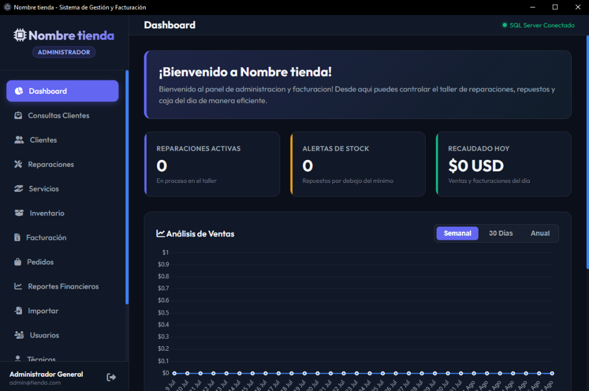

# Store - Sistema de Gestión y Facturación (POS & Soporte Técnico)

<p align="center">
  
</p>
Un sistema integral desarrollado para la administración completa de tiendas, talleres de electrónica y negocios de soporte técnico. Construido con tecnología de escritorio moderna (**Electron.js**) y respaldado por una base de datos robusta (**PostgreSQL**).

## 🚀 Características Principales

### 📊 Dashboard Inteligente
* Gráficas financieras automáticas (semanal, mensual, anual).
* Paneles en tiempo real de reparaciones urgentes y diagnósticos pendientes.
* Historial dinámico de las últimas facturas generadas.
* Alertas de stock bajo e indicadores de ganancias del día.

### 💬 Mensajería Omnicanal (Consultas)
* Bandeja unificada para comunicarte con tus clientes directamente desde el sistema.
* **WhatsApp Cloud API**: Envío y recepción de mensajes, imágenes, audios y videos.
* **Gmail**: Soporte directo vía correo electrónico.
* **Telegram Bot**: Notificaciones y comunicación automatizada.
* Sistema de notificaciones visuales (badges rojos) y **alertas de voz integradas** cuando llega un nuevo mensaje.

### 🛠️ Control de Taller (Reparaciones)
* Ingreso detallado de dispositivos por cliente (marcas, modelos, contraseñas, descripción del problema).
* Asignación de técnicos y estados (Recibido, En Diagnóstico, En Reparación, Reparado, Entregado).
* Conversión directa de una Orden de Reparación a una Factura comercial al concluir el trabajo.

### 📦 Gestión de Inventario Inteligente
* Control de stock de piezas y productos terminados.
* Alertas automáticas de stock mínimo.
* **Importación desde Excel masiva inteligente**: Si el producto ya existe, suma el stock automáticamente en lugar de sobreescribirlo; si es nuevo, lo crea.
* Módulo de servicios (Mano de obra y mantenimientos).

### 🧾 Facturación Electrónica (POS)
* Punto de Venta rápido para sumar servicios y repuestos al carrito.
* Cálculo automático de subtotales, IVA y descuentos.
* Generación de números secuenciales e identificadores clave compatibles con facturación (ej. SRI).
* Descarga directa en PDF e impresión. El inventario se descuenta de forma automática, a menos que solo se facture mano de obra/servicios.

### 📈 Reportes y Finanzas
* Módulo contable para consultar ingresos y facturación generada por fechas exactas (Diario, Semanal, Mensual o Personalizado).
* Historial de pedidos para revisar cualquier venta del pasado usando filtros por año y mes automático.

### 🔐 Seguridad y Usuarios
* Sistema de roles (Administrador y Staff).
* Protección de módulos críticos (Eliminar datos, Finanzas, y Configuración) solo para cuentas administradoras.

---

## 🛠️ Stack Tecnológico

* **Frontend:** HTML5, CSS3, JavaScript Vanilla (sin frameworks pesados para un rendimiento nativo ultrarrápido). Iconos de FontAwesome.
* **Backend / Desktop Framework:** [Electron.js](https://www.electronjs.org/) (Node.js integrado).
* **Base de Datos:** PostgreSQL (`pg` driver para Node).
* **Otras integraciones:** Chart.js (gráficos), xlsx (manipulación de Excel), window.speechSynthesis (alertas de voz).

---

## ⚙️ Instalación y Configuración

### 💿 Instalador Rápido (Recomendado para Windows)
Puedes instalar la aplicación completa, incluyendo configuración de base de datos y dependencias en un solo clic, usando nuestro instalador empaquetado:
🔗 **[Descargar Instalador V1.0 para Windows](https://github.com/Mijin-VT/Gestor-Tienda-Tech/releases/download/V1.0/Instalador_GestorTienda.exe)**

### 🐧 Paquete Nativo de Instalación (Linux)
Para sistemas basados en Debian (Ubuntu, Linux Mint, Pop!_OS, etc.), proporcionamos el instalador nativo oficial (`.deb`) que se integra perfectamente con el sistema:
🔗 **[Descargar Instalador V1.0 para Linux (.deb)](https://github.com/Mijin-VT/Gestor-Tienda-Tech/releases/download/V1.0/gestion_electronica-1.0.0.deb)**

**Pasos de instalación en Linux:**
1. **Configurar PostgreSQL:** Sigue la [Guía Paso a Paso de PostgreSQL](#-guía-paso-a-paso-de-instalación-y-configuración-de-postgresql).
2. **Instalar el Paquete:** Dale doble clic al archivo `.deb` descargado para abrirlo con el Centro de Software (o gestor de paquetes de tu sistema) y presiona "Instalar".
   - *Alternativa por terminal:* `sudo dpkg -i gestion_electronica-1.0.0.deb` (seguido de `sudo apt install -f` si hiciera falta alguna dependencia).
3. **Ejecutar:** Búscalo en tu menú de aplicaciones como "Gestor Tienda Tech" y ábrelo.

---

## 🗄️ Guía Paso a Paso: Instalación y Configuración de PostgreSQL

Para que el sistema funcione correctamente, requiere una instancia de **PostgreSQL** activa. A continuación se detallan los pasos exactos:

### 🐧 En Linux (Ubuntu / Debian / Derivados)

1. **Instalar PostgreSQL:**
   ```bash
   sudo apt update
   sudo apt install postgresql postgresql-contrib -y
   ```

2. **Iniciar y habilitar el servicio de PostgreSQL:**
   ```bash
   sudo systemctl start postgresql
   sudo systemctl enable postgresql
   ```

3. **Configurar la contraseña del usuario `postgres`:**
   Ingresa a la consola de PostgreSQL y define la contraseña (por defecto `admin123`): (o la contraseña de tu preferencia).
   ```bash
   sudo -u postgres psql -c "ALTER USER postgres PASSWORD 'admin123';"
   ```

4. **Crear la base de datos `TIENDA`:**
   ```bash
   sudo -u postgres psql -c "CREATE DATABASE \"TIENDA\";"
   ```

5. **Restaurar el esquema y tablas iniciales:**
   Ejecuta el archivo de esquema `base_de_datos_pg.sql` incluido en el proyecto:
   ```bash
   sudo -u postgres psql -d TIENDA -f base_de_datos_pg.sql
   ```

---

### 🪟 En Windows

1. **Descargar el Instalador Oficial:**
   Descarga PostgreSQL desde la página oficial: [https://www.postgresql.org/download/windows/](https://www.postgresql.org/download/windows/) (se recomienda versión 14, 15 o 16).

2. **Instalación:**
   * Ejecuta el instalador descargado.
   * Cuando el instalador te solicite la **contraseña del superusuario `postgres`**, ingresa: `admin123` (o la contraseña de tu preferencia).
   * Mantén el puerto predeterminado: `5432`.
   * Finaliza la instalación (no es necesario instalar componentes adicionales de Stack Builder).

3. **Crear la Base de Datos con pgAdmin o SQL Shell (psql):**
   * Abre **SQL Shell (psql)** desde el menú de inicio y presiona *Enter* para aceptar los valores predeterminados (Server: localhost, Database: postgres, Port: 5432, Username: postgres).
   * Escribe tu contraseña y presiona *Enter*.
   * Ejecuta los siguientes comandos:
     ```sql
     CREATE DATABASE "TIENDA";
     \c TIENDA
     \i 'd:/Desktop/AGENTES/GESTION_ELECTRONICA/base_de_datos_pg.sql'
     ```

---

### 🔧 Archivo de Configuración de Conexión (`db_config.json`)

Si instalaste PostgreSQL con un usuario, contraseña o puerto diferente, puedes personalizar la conexión editando el archivo `db_config.json` en la raíz de la aplicación:

```json
{
  "user": "postgres",
  "host": "localhost",
  "database": "TIENDA",
  "password": "tu_contraseña_aqui",
  "port": 5432
}
```

---

### 💻 Instalación Manual para Desarrollo (Desde Código Fuente)

1. **Prerrequisitos:** Node.js (v16+) y PostgreSQL instalado y en ejecución.
2. **Clonar el repositorio:**
   ```bash
   git clone https://github.com/Mijin-VT/Gestor-Tienda-Tech.git
   cd Gestor-Tienda-Tech
   ```
3. **Instalar dependencias de Node.js:**
   ```bash
   npm install
   ```
4. **Ejecutar en modo desarrollo:**
   ```bash
   npm start
   ```
5. **Credenciales de inicio de sesión por defecto:**
   * **Usuario:** `admin`
   * **Contraseña:** `admin`

---

## 📝 Personalización

Desde el panel de **Configuración** del sistema (solo acceso Administrador) puedes ajustar:
* Nombre comercial y RUC/NIT de la empresa.
* Impuestos predeterminados (Ej. IVA 15%).
* Credenciales de Gmail (App Password).
* Tokens de WhatsApp Business Cloud API.
* Token de Bot de Telegram.

---

> Desarrollado como una solución integral moderna para llevar el control total de talleres y negocios retail electrónicos.
